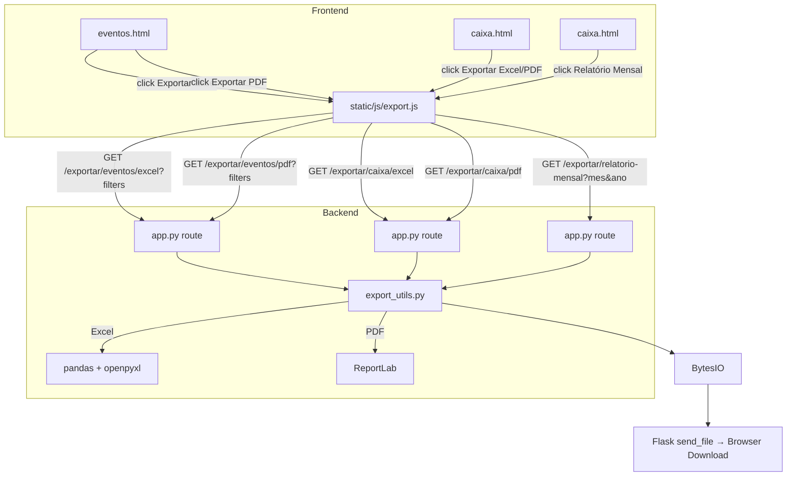
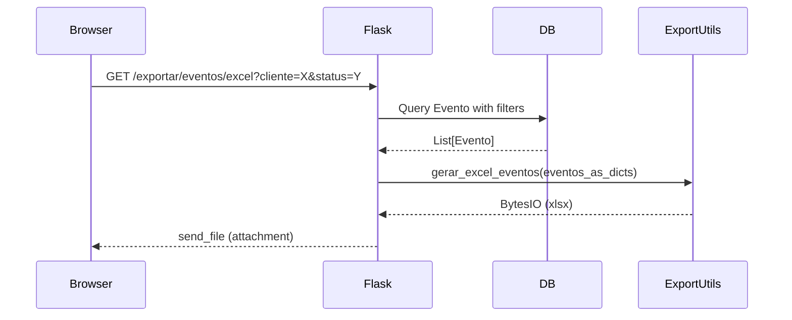

# Design Document: Export PDF/Excel

## Overview

This feature adds PDF and Excel export capabilities to the Photo Pro Studio system. It introduces a backend `export_utils.py` module that generates `.xlsx` files via pandas/openpyxl and `.pdf` files via ReportLab. New Flask routes serve the generated files as downloadable attachments. Frontend buttons with gradient styling and loading states trigger exports via JavaScript, passing current filter parameters as query strings.

The design prioritizes:

- Reuse of existing data models (Evento, Transacao) and query patterns from `app.py`
- Brazilian formatting (R$, dd/mm/yyyy) consistent with existing Jinja filters
- In-memory file generation (BytesIO) — no temp files on disk
- ReportLab for PDF (pure Python, no system dependencies like wkhtmltopdf)

### Key Research Findings

- **ReportLab** (`reportlab` package) provides `SimpleDocTemplate`, `Table`, `TableStyle`, and image embedding via `reportlab.lib.utils.ImageReader`. It supports A4 landscape, custom fonts, and color-coded cells. It's the most widely used pure-Python PDF library and avoids system-level dependencies.
- **pandas + openpyxl** (already installed) handle Excel generation natively via `DataFrame.to_excel()` with `openpyxl` as the engine. Number formatting can be applied via openpyxl styles after writing.
- **Flask's `send_file`** accepts `BytesIO` objects directly, setting Content-Type and Content-Disposition headers for downloads.

## Architecture



### Route Structure

| Route                        | Method | Description                     | Auth            |
| ---------------------------- | ------ | ------------------------------- | --------------- |
| `/exportar/eventos/excel`    | GET    | Export filtered events to Excel | @login_required |
| `/exportar/eventos/pdf`      | GET    | Export filtered events to PDF   | @login_required |
| `/exportar/caixa/excel`      | GET    | Export cash flow to Excel       | @login_required |
| `/exportar/caixa/pdf`        | GET    | Export cash flow to PDF         | @login_required |
| `/exportar/relatorio-mensal` | GET    | Monthly financial report PDF    | @login_required |

All routes accept filter parameters via query string and return file downloads.

## Components and Interfaces

### 1. `export_utils.py` — Export Engine Module

A new module at the project root containing pure functions for file generation. Each function receives data (lists of dicts or model objects) and returns a `BytesIO` object.

```python
# export_utils.py

def format_brl(value: float) -> str:
    """Format float as Brazilian currency string: R$ 1.234,56"""

def format_date_br(d: date) -> str:
    """Format date as dd/mm/yyyy"""

def gerar_excel_eventos(eventos: list[dict], data_atual: date) -> BytesIO:
    """Generate Excel file for events table with summary row."""

def gerar_pdf_eventos(eventos: list[dict], data_atual: date, logo_path: str) -> BytesIO:
    """Generate branded PDF for events table in A4 landscape."""

def gerar_excel_caixa(transacoes: list[dict], pendentes: list[dict],
                      entradas: float, saidas: float, saldo: float,
                      total_pendente: float, data_atual: date) -> BytesIO:
    """Generate Excel with 'Transações' and 'Pendentes' sheets."""

def gerar_pdf_caixa(transacoes: list[dict], pendentes: list[dict],
                    entradas: float, saidas: float, saldo: float,
                    data_atual: date, logo_path: str) -> BytesIO:
    """Generate branded PDF for cash flow with color-coded types."""

def gerar_pdf_relatorio_mensal(mes: int, ano: int,
                                eventos: list[dict], transacoes: list[dict],
                                resumo: dict, logo_path: str) -> BytesIO:
    """Generate monthly financial report PDF with summary and tables."""
```

### 2. Flask Routes in `app.py`

New routes added to `app.py` that:

1. Read filter parameters from `request.args`
2. Query the database using existing model patterns
3. Call `export_utils` functions
4. Return via `send_file(buffer, mimetype=..., as_attachment=True, download_name=...)`

Filter parameters for events: `cliente`, `servico`, `data_de`, `data_ate`, `status`
Filter parameters for monthly report: `mes`, `ano`

### 3. `static/js/export.js` — Frontend Export Handler

A new JS file that:

- Collects current filter values from the DOM
- Builds the export URL with query parameters
- Shows a loading spinner on the clicked button and disables it
- Triggers download via `window.location.href` assignment
- Restores button state after a timeout (since we can't detect download completion from JS)

```javascript
function exportar(tipo, formato) {
  // tipo: 'eventos' | 'caixa' | 'relatorio-mensal'
  // formato: 'excel' | 'pdf'
  // Collects filters, builds URL, triggers download
}
```

### 4. Template Changes

- **eventos.html**: Add two buttons ("Exportar Excel", "Exportar PDF") in the header area next to "Novo Evento"
- **caixa.html**: Add two buttons ("Exportar Excel", "Exportar PDF") near "Nova Transação", plus a "Relatório Mensal" button with month/year selector
- Both templates include `export.js` via ``

## Data Models

No new database models are needed. The feature reads from existing `Evento` and `Transacao` models.

### Data Flow: Events Export



### Data Transformation

Model objects are converted to dicts before passing to export functions, applying formatting:

```python
evento_dict = {
    'cliente': evento.cliente,
    'tipo_servico': evento.tipo_servico,
    'data_evento': evento.data_evento,        # date object
    'ensaios_extras': evento.ensaios_extras,
    'valor_negociado': evento.valor_negociado, # float
    'valor_pago': evento.valor_pago,           # float
    'status': evento.status
}
```

The export functions handle formatting (BRL currency, dd/mm/yyyy dates) internally.

### Monthly Report Summary Dict

```python
resumo = {
    'total_entradas': float,
    'total_saidas': float,
    'saldo_mes': float,
    'total_negociado': float,
    'total_recebido': float,
    'total_pendente': float
}
```

## Correctness Properties

_A property is a characteristic or behavior that should hold true across all valid executions of a system — essentially, a formal statement about what the system should do. Properties serve as the bridge between human-readable specifications and machine-verifiable correctness guarantees._

### Property 1: Brazilian currency formatting round-trip

_For any_ non-negative float value, `format_brl(value)` SHALL produce a string that starts with "R$ ", uses period as thousands separator, and comma as decimal separator with exactly 2 decimal places. Furthermore, parsing the numeric portion back (replacing separators) SHALL yield the original value rounded to 2 decimal places.

**Validates: Requirements 1.3, 2.4, 3.6, 4.4, 5.7**

### Property 2: Date formatting correctness

_For any_ valid Python `date` object, `format_date_br(d)` SHALL produce a string matching the pattern `DD/MM/YYYY` where DD is the zero-padded day, MM is the zero-padded month, and YYYY is the 4-digit year. Parsing this string back SHALL yield the original date.

**Validates: Requirements 1.4, 2.5, 3.7, 4.5, 5.8**

### Property 3: Events Excel data integrity

_For any_ non-empty list of event dicts, the Excel file produced by `gerar_excel_eventos` SHALL contain exactly N data rows (one per event), the header row SHALL contain all 7 required columns (Cliente, Tipo de Serviço, Data do Evento, Ensaios Extras, Valor Negociado, Valor Pago, Status), and the summary row's Valor Negociado total SHALL equal the sum of all individual Valor Negociado values, and likewise for Valor Pago.

**Validates: Requirements 1.1, 1.2, 1.5**

### Property 4: Cash flow Excel data integrity with multi-sheet structure

_For any_ list of realized transactions and list of pending transactions, the Excel file produced by `gerar_excel_caixa` SHALL have a main sheet with columns (Data, Tipo, Descrição, Categoria, Valor) containing all realized transactions, a "Pendentes" sheet containing all pending transactions, and summary rows where Total Entradas equals the sum of Entrada values, Total Saídas equals the sum of Saída values, and Saldo equals Entradas minus Saídas.

**Validates: Requirements 4.1, 4.2, 4.3, 4.6**

### Property 5: Monthly report summary computation

_For any_ set of transactions for a given month, the monthly report summary SHALL satisfy: `total_entradas` equals the sum of all Entrada transaction values, `total_saidas` equals the sum of all Saída transaction values, `saldo_mes` equals `total_entradas - total_saidas`, `total_negociado` equals the sum of `valor_negociado` for all non-cancelled events, `total_recebido` equals the sum of `valor_pago` for all non-cancelled events, and `total_pendente` equals `total_negociado - total_recebido`.

**Validates: Requirements 3.3**

### Property 6: Export filename pattern

_For any_ valid date and export type (eventos/excel, eventos/pdf, caixa/excel, caixa/pdf, relatorio_mensal), the generated filename SHALL match the expected pattern: `eventos_YYYY-MM-DD.xlsx`, `eventos_YYYY-MM-DD.pdf`, `caixa_YYYY-MM-DD.xlsx`, `caixa_YYYY-MM-DD.pdf`, or `relatorio_mensal_YYYY-MM.pdf` respectively, where date components are zero-padded.

**Validates: Requirements 1.7, 2.9, 3.10, 4.7, 5.10**

### Property 7: Export response headers

_For any_ successful export request, the response SHALL have Content-Type matching the file format (`application/vnd.openxmlformats-officedocument.spreadsheetml.sheet` for Excel, `application/pdf` for PDF) and Content-Disposition SHALL contain `attachment` with the correct filename.

**Validates: Requirements 7.6, 7.7**

## Error Handling

### Backend Error Strategy

All export routes wrap their logic in `try/except` blocks following the existing app.py pattern:

```python
@app.route('/exportar/eventos/excel')
@login_required
def exportar_eventos_excel():
    try:
        # ... query and generate
        return send_file(buffer, ...)
    except Exception as e:
        return jsonify({'error': f'Erro ao gerar Excel: {str(e)}'}), 500
```

### Specific Error Cases

| Error                        | Response                                                   | HTTP Code |
| ---------------------------- | ---------------------------------------------------------- | --------- |
| Unauthenticated request      | Redirect to login page                                     | 302       |
| ReportLab not installed      | JSON: `{"error": "Biblioteca ReportLab não instalada..."}` | 500       |
| Database query failure       | JSON: `{"error": "Erro ao consultar dados: ..."}`          | 500       |
| File generation failure      | JSON: `{"error": "Erro ao gerar [PDF/Excel]: ..."}`        | 500       |
| Invalid month/year parameter | JSON: `{"error": "Mês/ano inválido"}`                      | 400       |

### Frontend Error Handling

The `export.js` handles errors by:

1. Using `fetch()` instead of direct `window.location` for the request
2. Checking response status — if 200, creating a blob URL and triggering download
3. If error (4xx/5xx), parsing JSON error message and showing an alert
4. Always restoring button state (remove spinner, re-enable) in the `finally` block

```javascript
async function exportar(tipo, formato) {
  const btn = event.currentTarget;
  const originalHtml = btn.innerHTML;
  btn.disabled = true;
  btn.innerHTML = '<i class="fas fa-spinner fa-spin"></i> Gerando...';

  try {
    const response = await fetch(url);
    if (!response.ok) {
      const data = await response.json();
      alert(data.error || "Erro ao gerar exportação");
      return;
    }
    const blob = await response.blob();
    // trigger download via temporary <a> element
  } catch (e) {
    alert("Erro de conexão ao gerar exportação");
  } finally {
    btn.disabled = false;
    btn.innerHTML = originalHtml;
  }
}
```

## Testing Strategy

### Property-Based Tests (pytest + Hypothesis)

The feature uses **Hypothesis** as the property-based testing library for Python. Each property test runs a minimum of 100 iterations.

Property tests target the pure functions in `export_utils.py`:

| Property                           | Test Target                     | Min Iterations |
| ---------------------------------- | ------------------------------- | -------------- |
| P1: Currency formatting round-trip | `format_brl()`                  | 100            |
| P2: Date formatting round-trip     | `format_date_br()`              | 100            |
| P3: Events Excel data integrity    | `gerar_excel_eventos()`         | 100            |
| P4: Cash flow Excel multi-sheet    | `gerar_excel_caixa()`           | 100            |
| P5: Monthly summary computation    | Summary calculation logic       | 100            |
| P6: Filename pattern               | Filename generation helpers     | 100            |
| P7: Response headers               | Flask test client export routes | 100            |

Each test is tagged with: `# Feature: export-pdf-excel, Property {N}: {description}`

### Unit Tests (pytest)

Example-based tests for specific scenarios:

- Empty events list → Excel with header + zero summary (Req 1.6)
- Empty events list → PDF with "Nenhum evento encontrado" message (Req 2.8)
- Empty month → PDF with zero summary and "Nenhum registro" message (Req 3.9)
- Empty transactions → PDF with "Nenhuma transação encontrada" (Req 5.9)
- Portuguese month names for all 12 months (Req 3.8)
- A4 landscape page dimensions in PDF (Req 2.7)
- Error response on generation failure (Req 7.3, 7.4)
- Missing ReportLab dependency error (Req 7.5)

### Integration Tests (pytest + Flask test client)

- Authentication required on all 5 export endpoints (Req 7.1, 7.2)
- Successful download with correct headers for each endpoint
- Filter parameters correctly applied to event queries
- Monthly report with real database data

### Test Dependencies

```
hypothesis>=6.0
pytest>=7.0
```

These are dev-only dependencies, not added to the production `requirements.txt`.
