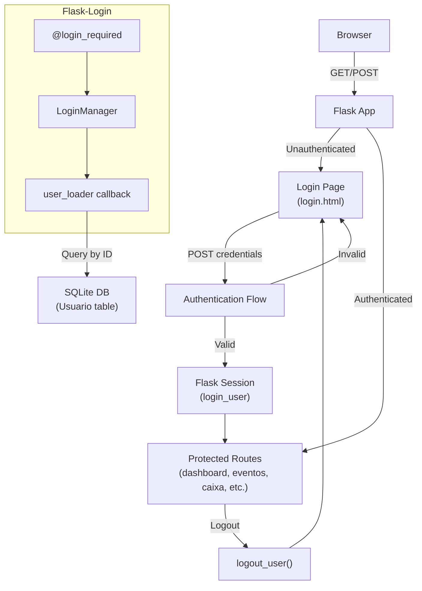

# Design Document: User Authentication

## Overview

This design adds session-based authentication to Photo Pro Studio using Flask-Login. The system is single-user (the photographer), so the design is intentionally simple: one `Usuario` model, a CLI command to create the admin, a login page matching the existing gradient style, and `@login_required` on all routes. Flask-Login handles session management, remember-me cookies, and the user loader callback.

Key design decisions:

- **Flask-Login** over manual session management — proven library, handles remember-me and session security out of the box.
- **Single file integration** — all auth code lives in `app.py` alongside existing models and routes, keeping the project's current single-file architecture.
- **werkzeug.security** for password hashing — already a Flask dependency, no extra packages needed.
- **Default admin auto-creation** — if no user exists at DB init time, a default admin/admin account is created so the system is immediately usable.
- **`os.urandom`-based SECRET_KEY** — replaces the hardcoded placeholder with a generated key stored in an environment variable or `.env` file.

## Architecture



### Request Flow

1. User requests any route → Flask-Login's `@login_required` checks session
2. If no session → redirect to `/login` (preserving `next` URL)
3. User submits credentials → `check_password_hash` validates → `login_user()` creates session
4. Redirect to `next` URL or dashboard
5. API routes (`/api/*`) return 401 JSON instead of redirecting

## Components and Interfaces

### 1. Usuario Model (SQLAlchemy + UserMixin)

```python
class Usuario(UserMixin, db.Model):
    id: int              # Primary key
    username: str         # Unique, max 80 chars
    password_hash: str    # Max 256 chars

    def set_password(password: str) -> None
    def check_password(password: str) -> bool
```

### 2. LoginManager Configuration

```python
login_manager = LoginManager()
login_manager.init_app(app)
login_manager.login_view = 'login'
login_manager.login_message = 'Por favor, faça login para acessar o sistema.'
login_manager.login_message_category = 'info'

@login_manager.user_loader
def load_user(user_id: str) -> Optional[Usuario]:
    return Usuario.query.get(int(user_id))
```

### 3. Routes

| Route               | Method    | Auth     | Description                            |
| ------------------- | --------- | -------- | -------------------------------------- |
| `/login`            | GET, POST | Public   | Login page and credential validation   |
| `/logout`           | GET       | Required | Terminates session, redirects to login |
| All existing routes | \*        | Required | `@login_required` decorator added      |
| `/api/*`            | \*        | Required | Returns 401 JSON if unauthenticated    |

### 4. CLI Command

```
flask create-admin --username <user> --password <pass>
```

Registered via `@app.cli.command('create-admin')` with `click.option` for username and password.

### 5. Templates

- **`login.html`** — Standalone page (no navbar), centered card with gradient header, logo, form fields (Usuário, Senha, Lembrar-me, Entrar button).
- **`base.html`** — Modified navbar to show username + "Sair" link when authenticated, hidden on login page.

### 6. Unauthorized API Handler

Custom `@login_manager.unauthorized_handler` that checks if the request path starts with `/api/` and returns JSON 401 instead of redirecting.

## Data Models

### Usuario Table

| Column        | Type        | Constraints       | Description            |
| ------------- | ----------- | ----------------- | ---------------------- |
| id            | Integer     | PK, autoincrement | User identifier        |
| username      | String(80)  | unique, not null  | Login username         |
| password_hash | String(256) | not null          | Werkzeug password hash |

### Database Migration Strategy

The `Usuario` table is created alongside existing tables via `db.create_all()`. Since the project uses SQLite with `db.create_all()` (no Alembic), the new table is added automatically without affecting existing `Evento` and `Transacao` tables.

### Default Admin Initialization

After `db.create_all()`, the app checks if any `Usuario` record exists. If not, it creates a default user with username `"admin"` and password `"admin"` (hashed). This runs once on first startup.

## Correctness Properties

_A property is a characteristic or behavior that should hold true across all valid executions of a system — essentially, a formal statement about what the system should do. Properties serve as the bridge between human-readable specifications and machine-verifiable correctness guarantees._

### Property 1: Password hash round-trip

_For any_ valid password string, calling `set_password(password)` followed by `check_password(password)` SHALL return `True`, and calling `check_password(other_password)` where `other_password != password` SHALL return `False`.

**Validates: Requirements 1.3, 1.4**

### Property 2: CLI create-admin produces hashed user

_For any_ valid username and password pair, executing the `create-admin` CLI command SHALL create a `Usuario` record in the database where `password_hash` is not equal to the plaintext password and `check_password(password)` returns `True`.

**Validates: Requirements 2.2**

### Property 3: CLI create-admin rejects duplicate username

_For any_ existing `Usuario` with a given username, executing the `create-admin` CLI command with the same username SHALL fail with an error message and leave the existing record's `password_hash` unchanged.

**Validates: Requirements 2.3**

### Property 4: Valid credentials produce authenticated session

_For any_ `Usuario` with a known password, submitting that username and password to the login route SHALL result in an authenticated session and a redirect to the dashboard (or the `next` URL).

**Validates: Requirements 3.4**

### Property 5: Invalid credentials are rejected

_For any_ login attempt where the username does not exist or the password does not match, the login route SHALL not create an authenticated session and SHALL return the login page with an error flash message.

**Validates: Requirements 3.5**

### Property 6: Protected routes redirect unauthenticated users

_For any_ non-login, non-API application route, an unauthenticated request SHALL receive a redirect response to the login page.

**Validates: Requirements 4.1, 4.2**

### Property 7: Next URL preservation through login flow

_For any_ protected route URL, when an unauthenticated user is redirected to login, the redirect SHALL include the original URL as the `next` parameter, and after successful login the user SHALL be redirected to that original URL.

**Validates: Requirements 4.3**

### Property 8: API routes return 401 for unauthenticated requests

_For any_ API route (path starting with `/api/`), an unauthenticated request SHALL receive an HTTP 401 status code with a JSON error response.

**Validates: Requirements 4.4, 4.5**

### Property 9: user_loader returns correct user by ID

_For any_ `Usuario` stored in the database, the `user_loader` callback SHALL return the correct `Usuario` object when called with that user's ID, and SHALL return `None` when called with a non-existent ID.

**Validates: Requirements 6.2**

## Error Handling

| Scenario                       | Behavior                                                                                          |
| ------------------------------ | ------------------------------------------------------------------------------------------------- |
| Invalid login credentials      | Flash message "Usuário ou senha inválidos.", stay on login page                                   |
| Unauthenticated page access    | Redirect to `/login` with `next` parameter, flash "Por favor, faça login para acessar o sistema." |
| Unauthenticated API access     | Return HTTP 401 `{"error": "Autenticação necessária."}`                                           |
| Duplicate username in CLI      | Print "Usuário já existe!", exit without changes                                                  |
| Database error during login    | Catch exception, flash generic error, stay on login page                                          |
| Invalid `next` URL after login | Validate URL is relative (no external redirects), fallback to dashboard                           |
| Missing SECRET_KEY env var     | Generate a random key at startup, log a warning to set it permanently                             |

## Testing Strategy

### Property-Based Tests (Hypothesis)

The project will use **Hypothesis** (Python PBT library) for property-based testing. Each property test runs a minimum of 100 iterations.

| Test                             | Property                                          | Iterations |
| -------------------------------- | ------------------------------------------------- | ---------- |
| `test_password_hash_roundtrip`   | Property 1: Password hash round-trip              | 100+       |
| `test_cli_creates_hashed_user`   | Property 2: CLI create-admin produces hashed user | 100+       |
| `test_cli_rejects_duplicate`     | Property 3: CLI create-admin rejects duplicate    | 100+       |
| `test_valid_login_authenticates` | Property 4: Valid credentials authenticate        | 100+       |
| `test_invalid_login_rejected`    | Property 5: Invalid credentials rejected          | 100+       |
| `test_protected_routes_redirect` | Property 6: Protected routes redirect             | 100+       |
| `test_next_url_preserved`        | Property 7: Next URL preservation                 | 100+       |
| `test_api_routes_return_401`     | Property 8: API 401 for unauthenticated           | 100+       |
| `test_user_loader_correctness`   | Property 9: user_loader returns correct user      | 100+       |

Each test will be tagged with: `# Feature: user-authentication, Property N: <property_text>`

### Unit Tests (pytest)

| Test                              | Validates                                                       |
| --------------------------------- | --------------------------------------------------------------- |
| `test_usuario_model_schema`       | Req 1.1, 1.2 — column types and constraints                     |
| `test_usuario_has_usermixin`      | Req 1.5 — is_authenticated, is_active, is_anonymous, get_id     |
| `test_cli_command_exists`         | Req 2.1 — create-admin is registered                            |
| `test_cli_success_message`        | Req 2.4 — confirmation message output                           |
| `test_default_admin_created`      | Req 2.5 — admin/admin on empty DB                               |
| `test_login_page_elements`        | Req 3.1, 3.2, 3.3, 3.6 — form fields, gradient, logo, Bootstrap |
| `test_remember_me_cookie`         | Req 3.7 — persistent session with remember                      |
| `test_logout_terminates_session`  | Req 5.1, 5.2 — logout route and redirect                        |
| `test_navbar_shows_username`      | Req 7.1 — username in navbar when authenticated                 |
| `test_navbar_shows_sair`          | Req 5.3, 5.4, 7.2 — Sair link with correct href                 |
| `test_login_page_no_navbar`       | Req 7.3 — no navbar on login page                               |
| `test_login_manager_config`       | Req 6.1, 6.3, 6.4 — LoginManager settings                       |
| `test_secret_key_not_placeholder` | Req 6.5 — SECRET_KEY is not hardcoded                           |

### Test Configuration

- Framework: **pytest** with **Flask test client**
- PBT library: **Hypothesis** (`hypothesis[pytest]`)
- Each test uses an in-memory SQLite database (`sqlite:///:memory:`)
- Test fixtures create a fresh Flask app context per test
